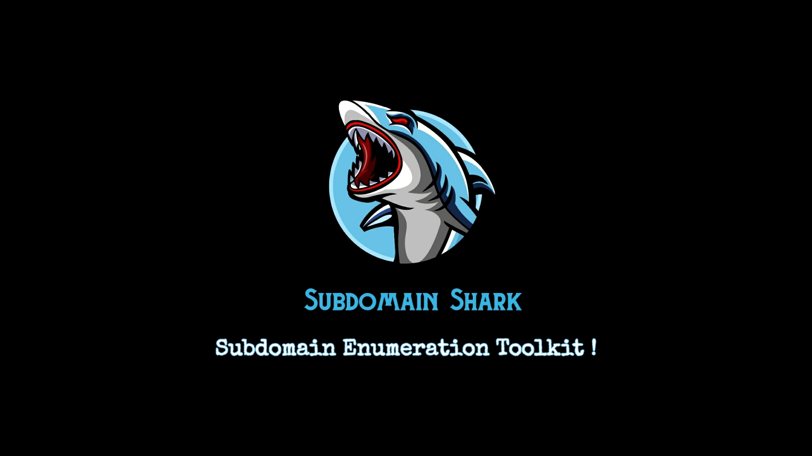

# Subd0mainShark🦈
<br>
* `Subd0main Shark is a python tool designed to enumerate subdomains of websites⚡`

* `It helps penetration testers and bug hunters collect and gather subdomains for the domain they are targeting✨`

* `The credit goes to *Encrypted Noob* who is the author of Subd0main Shark`

## Disclaimer
*This tool is for educational purposes only !*<br />

*I will not be responsible for any misuse*⚠️

## Usage
Clone it by
```bash
git clone https://github.com/encryptedn00b/Subd0mainShark
```
Go to the Subshark Directory
```bash
cd Subd0mainShark
```
Run it
```bash
python3 SubdomainShark.py
```
